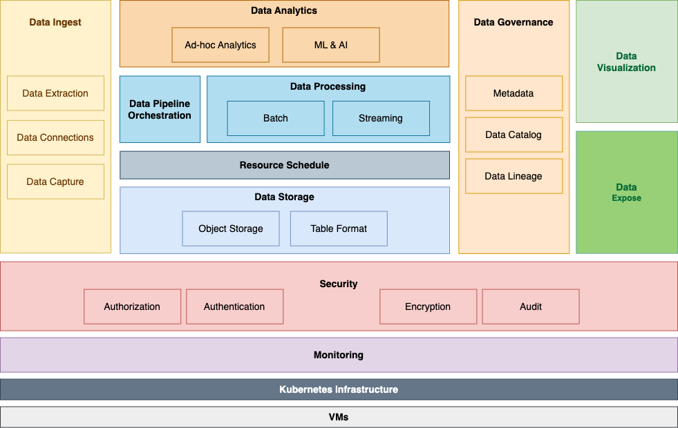

# KubeLake 

## What is Kubelake ?
**KubeLake** is a Big Data and AI platform on Kubernetes designed to manage, process and analyze massive volumes 
of data in an efficient and scalable way. 

It provides a flexible and scalable infrastructure for storing, processing and analyzing data both in real-time and in batch mode.

### Features: 
- Horizontal Scalability: The platform can scale horizontally to cope with the increase in data volume and processing requests.
- Elasticity: The ability to automatically scale resources according to load requirements, ensuring efficient use of resources.
- Resilience: The platform is resistant to failures, having the ability to automatically detect and manage hardware or software failures.
- Security: Implements advanced security measures to protect data against unauthorized access and cyberattacks.

### Advantages:
- Efficiency: The platform offers an efficient and scalable infrastructure to effectively manage and process big data.
- Performance: The use of Big Data technologies ensures high performance for data processing and analysis.
- Flexibility: The platform offers flexibility to run different types of applications and data analysis tasks.
- Reduced Costs: Using Kubernetes for orchestration and resource management helps reduce operational costs.

## Requirements
- Kubernetes cluster installed 
    - min 1 control-planer node 
    - min 3 workers nodes
- access the cluster using the Kubernetes API
- access the cluster with `kubectl` and `helm`
- two storage class
    - replicated 
    - unreplicated   
- nginx Ingress controller
- Cert-manager
- Minio operator
- Strimzi (Kafka) operator
- PostgreSQL operator (CNPG)
- Keycloak
- metrics-server
- public DNS & external reverse-proxy   

NOTE: For guidance on installation and usage, you can consult Esolutions's Kubesol, 
a free and open-source project: https://github.com/eSolutionsTech/kubesol/blob/main/docs/README.md

## Included modules in Kubelake (bird's eye view)
The platform includes the following modules, each containing at least one component.

1. [Data Ingest](1-ingest.md) 
2. [Data Storage](2-storage.md)
3. [Data Processing](3-processing.md)
4. [Data Streaming](4-streaming.md)
5. [Data Analytics](5-analytics.md)
6. [Data Expose](6-expose.md)
7. [Data Visualization](7-visualization.md)

## Demo k8s
Let's go behind the curtains a little bit and see the modules installed.

## Workshop

[Workshop](workshop.md)

