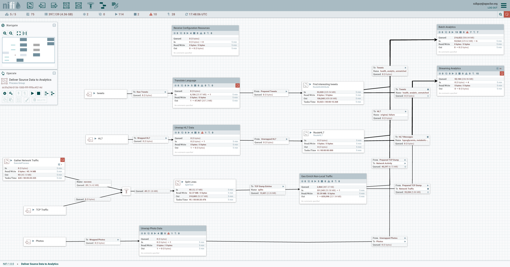

# Ingest module

## Apache NiFi
Apache NiFi is a data integration tool designed to automate the flow of data between software systems.
It provides a web-based user interface for designing, controlling, and monitoring data flows.
See more at [https://nifi.apache.org](https://nifi.apache.org).
We'll go into more detail at the exercise phase.

### Usage
The User Interface URL is something like `https://nifi.<<domain>>`. 

