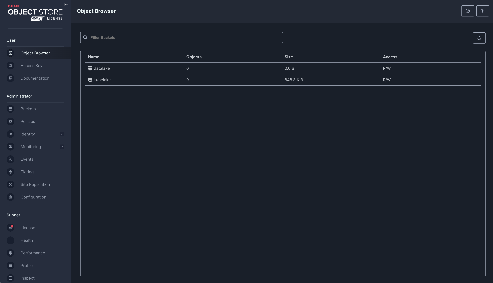

# Storage module

## Minio 

MinIO is a high-performance Object Storage compatible with S3. See more at [https://min.io](https://min.io).

NOTE: For Minio install, you can consult Esolutions's Kubesol, 
a free and open-source project:
https://github.com/eSolutionsTech/kubesol/blob/main/docs/components/minio.md; 

### Usage (for the hand's on stage)
A bucket is already created:

- **datalake**: used to store data.

User Interface URL is something like `https://storage.<<domain>>`.

