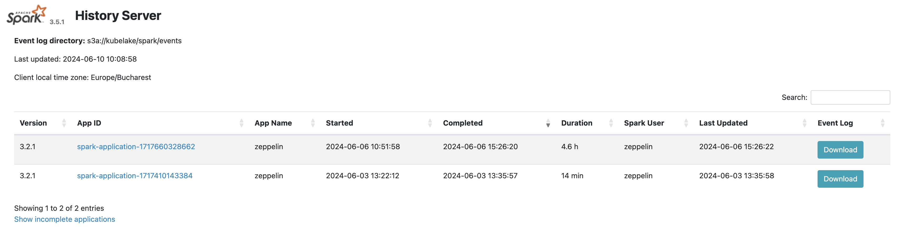

# Processing module

## Spark Operator
Apache Spark is a unified analytics engine for large-scale data processing. 
See more at [https://spark.apache.org](https://spark.apache.org).

#### Spark History User Interface
User Interface URL is something like `https://spark.<<domain>>`,

