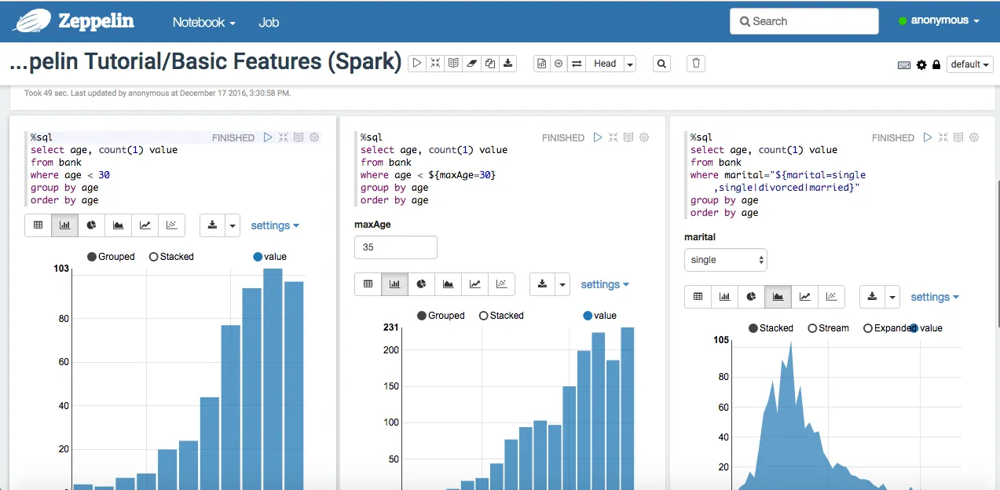

# Analytics module

## Zeppelin
Zeppelin is a web-based notebook that enables data-driven, interactive data analytics and collaborative documents
with SQL, Scala, Python, R and more. See more at [https://zeppelin.apache.org](https://zeppelin.apache.org)

### Usage
User Interface URL is something like `https://zeppelin.<<domain>>`. 

