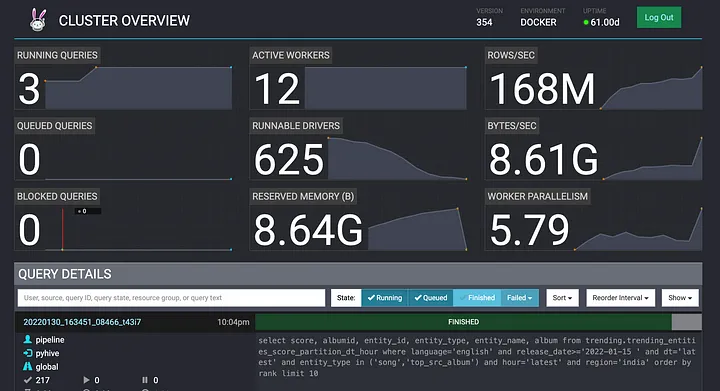

# Expose module

## Trino
Trino is an ANSI SQL compliant distributed query engine, 
that works with BI tools such as R, Tableau, Power BI, Superset and many others.
See more at [https://trino.io](https://trino.io).

### Usage
- User Interface URL is something like `https://trino.<<domain>>`. 

Note: by default, two connections are defined: 

- lakehouse - delta lake connection.
- kafka.

