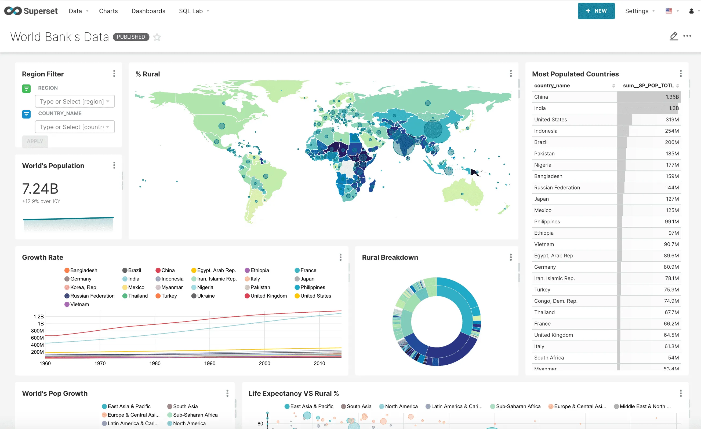

# Visualization module 

## Superset
Apache Superset is a modern, open-source data exploration and visualization platform designed to be enterprise-ready.
See more at [https://superset.apache.org](https://superset.apache.org).

### Usage
User Interface URL is something like `https://superset.<<domain>>`. 

By default, a new database named `lakehouse-db` is created and connected to the Trino
_lakehouse_ connection.

