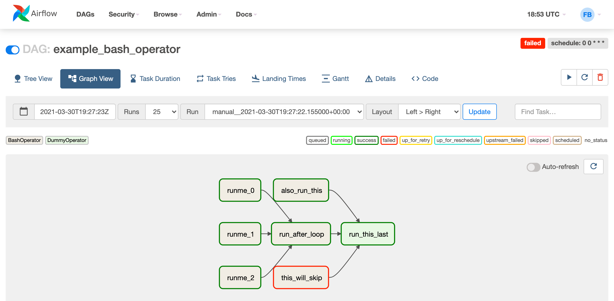

# Orchestration module

## Airflow
Apache Airflow provides a robust and flexible way to manage and automate complex data pipelines,
ensuring tasks are executed in the correct order and at the right time.
See more at [https://airflow.apache.org](https://airflow.apache.org)

### Usage
User Interface URL is something like `https://airflow.<<domain>>`.

