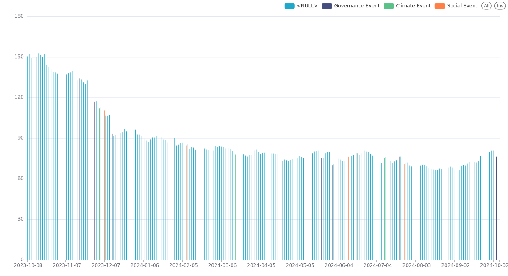

# Exercise 3: Visualizing Data with Apache Superset

# Visualize Processed Data Stored in MinIO using Zeppelin and Apache Superset

## Introduction

In this plan, we will:

1. Visualize the processed data in **Zeppelin** for ad-hoc visualizations.
2. Later, create more formal dashboards using **Apache Superset** to visualize key metrics.

### Prerequisites

- **Zeppelin notebook** is configured with Spark to access the processed data stored in **MinIO** ([Zeppelin](https://zeppelin.dev1.kubelake.com))
- **Apache Superset** is installed and configured with access to MinIO Delta tables([Superset](https://superset.dev1.kubelake.com))


---

## Step 1: Visualizations in Zeppelin

Zeppelin has built-in charting capabilities for basic visualizations.
After running the aggregation or a query, switch the result to visualizations using Zeppelin's built-in tools (z.show).
You can select from pie charts, bar charts, scatter plots, etc.

After performing the aggregation:
Click on Bar Chart, Line Chart, or Pie Chart options on the Zeppelin result window.

Let's visualise stock Price over Time (as a bar chart)

```

val stockPriceOverTime = df.select("date", "close" ,"event_type")
z.show(stockPriceOverTime)
```

## Step 2: Visualize Data Using Apache Superset

## What is Apache Superset?

Apache Superset is a popular open-source data exploration and visualization tool.
It allows users to create **interactive dashboards** and **charts** with minimal code, making it easy for 
**business users** and **data analysts** to access and understand their data. Superset supports a wide range 
of SQL-speaking databases, and its ability to integrate with distributed query engines like **Trino** makes it particularly powerful for querying large datasets.

## What is Trino?

Trino (formerly known as PrestoSQL) is a **distributed SQL query engine** designed for running **fast** queries on **large datasets**
that are spread across multiple data sources.
Unlike traditional databases, Trino can query data in various formats (such as JSON, Parquet, ORC) from different systems
(like Delta Lake, Kafka, S3, HDFS, etc.) without moving the data. It’s commonly used to query data lakes, data warehouses,
and even streaming data in real-time. 
Trino acts as a **query layer**, sitting **between** your **storage** layer and your **visualization** tool.

## How Superset Connects to Trino

- Superset connects to Trino through a pre-configured database connection.
- Trino connects to various catalogs (such as Delta Lake and Kafka) that store or manage the actual data.
- Once configured, users can create visualizations in Superset by querying data in systems like Delta Lake or Kafka directly through Trino.

### Superset -> Trino -> Delta Lake

In this scenario, Superset is configured to connect to Trino, and Trino, in turn,
has a catalog connection to Delta Lake. 
Delta Lake stores large datasets in a structured format that Trino can query.
Superset users can visualize this data in real-time by querying the Delta Lake through Trino.
        
        connector.name=delta_lake
        hive.metastore.uri=thrift://{metastore_uri}.svc.cluster.local:9083
        hive.s3.ssl.enabled=false
        hive.s3.endpoint=http://{minio}.svc.cluster.local
        hive.s3.path-style-access=true
        delta.enable-non-concurrent-writes=true
        delta.register-table-procedure.enabled=true

### Superset -> Trino -> Kafka

Similarly, Superset can connect to a Kafka topic (created explicitly, users cannot create Kafka topics) through Trino.
Kafka is often used for real-time event streaming, and Trino’s ability to query streaming data from Kafka enables users to 
create dashboards that reflect live data changes in Superset.

        connector.name=kafka
        kafka.nodes={kafka-broker}.svc.cluster.local:9092
        kafka.table-names={topic}
        kafka.hide-internal-columns=false


Now, let's create visualizations and dashboards in Superset.
#### 2.1 Create Charts to Visualize Key Metrics

Let's log together into [Superset](https://superset.dev1.kubelake.com) then DIY the rest (10 - 20 min)

- credentials ->  demo@kubelake.com : ask me for the password

We'll use the SQL Lab to run some queries on our data 

- database **trino-lakehouse**
- schema **default**
- table **your_delta_table_previously_created**

DIY the Rest


Create the dataset on our data

- on the Datasets -> new Dataset
- select our database **trino-lakehouse** and schema **default**
- select  **your_delta_table_previously_created**
- create dataset and chart

Create the chart on our dataset

- Choose a Bar Chart.
- Set **date**  as the x-axis and **sum(close)** as the metric.
- Add event_type as Dimension
- Adjust the chart settings and labels.


We should have a chart now on which we can see how the price evolved, and also we can filter by the event type.



## Summary

In this step, we learned how to:

- Use Zeppelin for quick, ad-hoc visualizations by loading data from our data lake and using its built-in charting capabilities.
- Use Apache Superset to create more formal dashboards that visualize key metrics.

What did you think is the hardest part about visualising?
