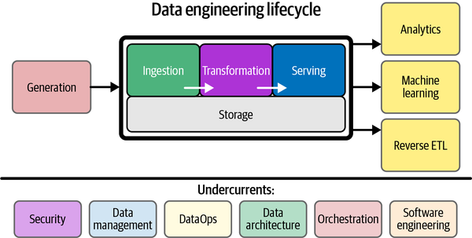

# Exercise 4: Putting It All Together

### Objective:
Let's see how all the components combine to create a fully functional data pipeline.
We could also see how a streaming usecase would be done

### Do you have any other questions or any feedback for what you would have wanted to see ?
