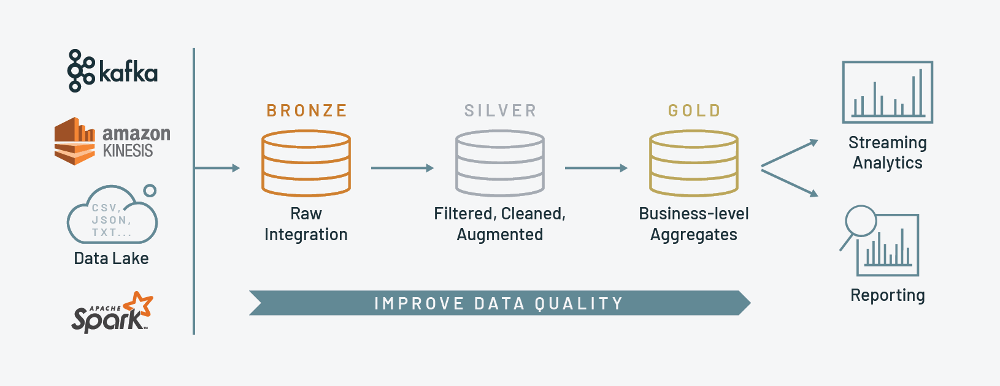

# Workshop Blueprint

## Overview:

This workshop will guide participants through setting up a scalable data pipeline using a combination of Apache NiFi, Spark (through Zeppelin), MinIO,  and Superset. 

All component are already installed using K8s, allowing participants to build a complete ETL (Extract, Transform, Load) pipeline.


We will also model the data using a medallion architecture and group the data into different zones.


## Prerequisites:
- A working laptop because this workshop will only be done on the browser!!
- Basic programming skills in Scala or Python (for Spark).

---

## Exercise 0: Connecting to the remote environment and clone the exercises repository

[Exercise 0](exercises/0-Setup/workshop.md)

## Exercise 1: Data Ingestion with Apache NiFi
[Exercise 1](exercises/1-Ingest/workshop.md)

## Exercise 2: Batch Processing with Apache Spark
[Exercise 2](exercises/2-Processing/workshop.md)

## Exercise 3: Visualizing Data
[Exercise 3](exercises/3-Visualisation/workshop.md)

## Exercise 4: Putting It All Together
[Final](exercises/4-Final/workshop.md)

Here’s a representation of the workshop pipeline:

```plaintext
Data API --> NiFi --> Minio --> Spark --> Minio --> Superset
```

