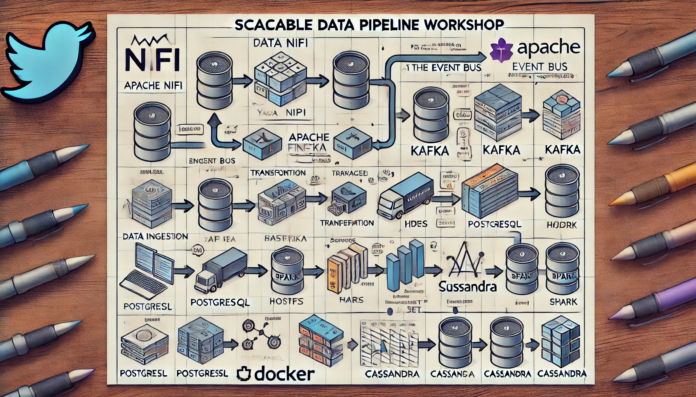

# Workshop Blueprint

## Overview:
This workshop will guide participants through setting up a scalable data pipeline using a combination of Apache NiFi, 
Kafka, Spark, Monio, Zeppelin and Superset. 
All component are already installed using K8s, allowing participants to build a complete ETL (Extract, Transform, Load) pipeline.

## Prerequisites:
- Basic knowledge of K8s
- Basic programming skills in Python or Scala (for Spark).

---

## Exercise 0: Connecting to remote environment and clone exercises repo
[Exercise 0](exercises/0-setup/workshop.md)

## Exercise 1: Data Ingestion with Apache NiFi
[Exercise 1](exercises/1-ingest/workshop.md)

## Exercise 2: Batch Processing with Apache Spark
[Exercise 2](exercises/2-processing/workshop.md)

## Exercise 3: Visualizing Data with Apache Superset
[Exercise 3](exercises/3-visualisation/workshop.md)

## Exercise 4: Putting It All Together
[Final](exercises/4-final/workshop.md)

Here’s a visual representation of the workshop pipeline:

```plaintext
Data API --> NiFi --> Kafka --> Spark --> Minio --> Superset
```


